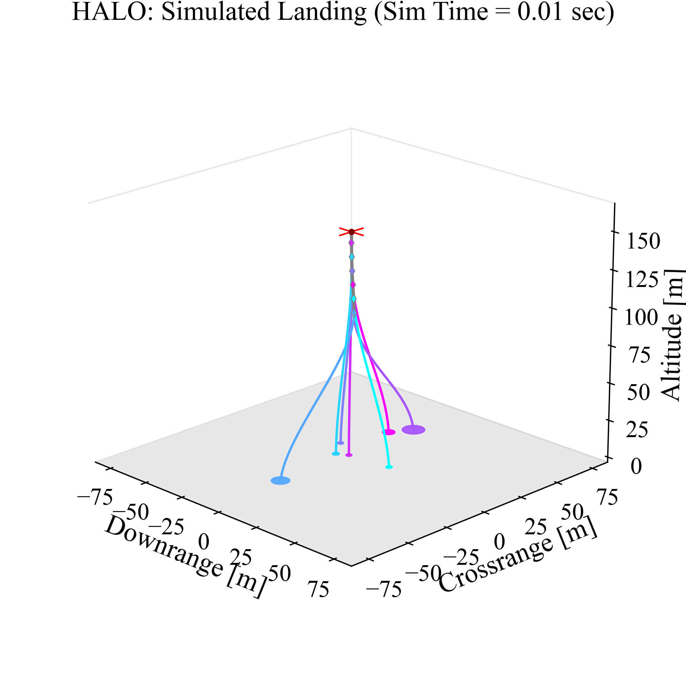

# AdaptiveDDTO
<p align="center">
  
</p>

## Overview
This repository contains all (ongoing) research developmental work on Adaptive Deferred-Decision Trajectory Optimization **(Adaptive-DDTO)**, a robust path-planning algorithm which maintains multiple targets in the reachable set of the ego vehicle and adaptively recomputes once the target count falls below a preset threshold. An implementation of **Adaptive-DDTO** for the quadcopter landing problem (as described in the HALO research paper, see below) is provided in the 📂`src` folder. Please see the following papers for more context:
- [HALO: Hazard-Aware Landing Optimization for Autonomous Systems]([https://arxiv.org/abs/2304.01583](https://ieeexplore.ieee.org/abstract/document/10160655))
- [Deferring Decision in Multi-target Trajectory Optimization](https://arc.aiaa.org/doi/abs/10.2514/6.2022-1583) (along with [this presentation](https://www.aa.washington.edu/sites/aa/files/news/2022%20Research%20Showcase%20pdfs/Purna_DDTO_poster.pdf))

## Setup
This repository contains entirely Julia code, with associated Manifest/Project files at the top level (for more information on how Julia works, see [the Julia tutorials page](https://julialang.org/learning/tutorials/)). All code is contained within the 📂`src` folder, which notably contains a 📜`demo.ipynb` jupyter notebook file that demonstrates the capabilities of Adaptive-DDTO on a sandbox problem, along with all associated solving, plotting and utility files. Currently, you will need to have all packages mentioned in 📜`src/setup.jl` for both internal use in this package, and for use in the HALO framework as a submodule.

## Citing
If you use Adaptive-DDTO in your research, kindly cite the following associated publication.
```
@inproceedings{hayner2023halo,
  title={HALO: Hazard-Aware Landing Optimization for Autonomous Systems},
  author={Hayner, Christopher R and Buckner, Samuel C and Broyles, Daniel and Madewell, Evelyn and Leung, Karen and A{\c{c}}ikme{\c{s}}e, Beh{\c{c}}et},
  booktitle={2023 IEEE International Conference on Robotics and Automation (ICRA)},
  pages={3261--3267},
  year={2023},
  organization={IEEE}
}
```
