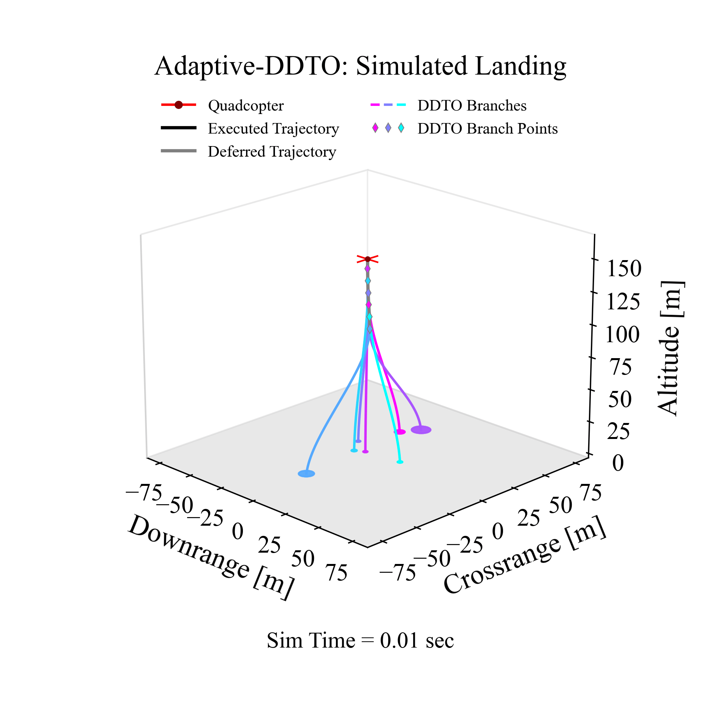

# AdaptiveDDTO

  

## Overview
This repository contains all (ongoing) research developmental work on Adaptive Deferred-Decision Trajectory Optimization **(Adaptive-DDTO)**, a robust path-planning algorithm which maintains multiple targets in the reachable set of the ego vehicle and adaptively recomputes once the target count falls below a preset threshold. An implementation of **Adaptive-DDTO** for the quadcopter landing problem (as described in the HALO research paper, see below) is provided in the 📂src/ folder. Please see the following papers for more context:
- [HALO: Hazard-Aware Landing Optimization for Autonomous Systems](https://arxiv.org/abs/2304.01583)
- [Deferring Decision in Multi-target Trajectory Optimization](https://arc.aiaa.org/doi/abs/10.2514/6.2022-1583) (along with [this presentation](https://www.aa.washington.edu/sites/aa/files/news/2022%20Research%20Showcase%20pdfs/Purna_DDTO_poster.pdf))
